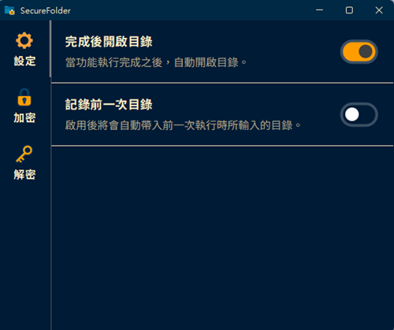
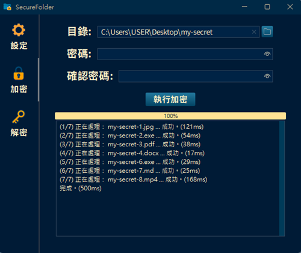
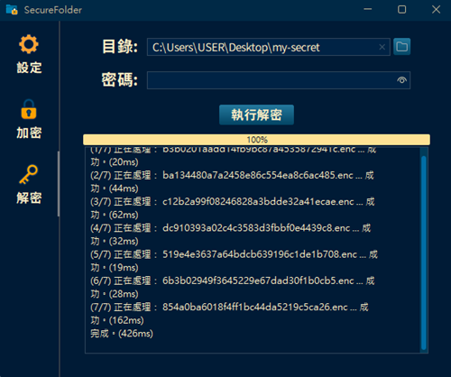

# SecureFolder 資料夾加密工具

SecureFolder 是一款簡單易用的 Java 桌面應用程式。

適合用來保護個人文件、專案資料，或任何不希望被未授權讀取的檔案。

| 偏好設定 | 加密 | 解密 |
|:-:|:-:|:-:|
|  |  |  |

## ✨ 功能簡介

SecureFolder 會指定資料夾內的所有檔案進行**加密與解密**。

加密後的檔案會轉換為 `.enc` 檔案，使用現代加密演算法（AES-256 GCM）。

本程式提供直覺的圖形化介面，無需任何指令操作即可使用，具備以下功能：

- 採用 **AES-256 GCM** 現代加密演算法
- 支援巢狀子資料夾（遞迴處理）
- 日誌顯示單一檔案的執行結果與耗時
- 自動偵測處理檔案的總大小，檔案過大時會顯示警示彈窗
- 進度條即時顯示目標處理進度
- 支援執行過程中途中止
- 功能執行完成後可自動開啟目標資料夾
- 自動記錄上一次操作所選擇的資料夾路徑，方便重複使用
- 加密後的`.enc` 檔案可以自由搬移位置，不影響後續解密
- 已打包為 Windows 可執行檔，無需安裝 Java 即可直接使用

## 🖥️ 系統需求

- Windows 10 / 11
- 64 位元作業系統
- 無需另外安裝 Java（已內建 Runtime）

## 🧰 安裝與使用

你可以直接執行打包好的 Windows `.exe` 應用程式：

1. 前往 [Releases](https://github.com/yungyun351/secure-folder/releases/latest)下載最新版本的 `SecureFolder`。
2. 解壓縮後執行 `SecureFolder.exe`。
3. 開啟視窗後可先調整偏好設定，即可開始使用加密 / 解密功能。

## 🔒 加密技術說明

- 加密演算法：**AES-256 GCM**
- 金鑰衍生：**PBKDF2 (HmacSHA256)**
- 每個檔案都會產生獨立的 Salt 與 IV
- 密碼不會被儲存於檔案或系統中

> 本工具專注於本機檔案加密，不會連線至網路或上傳任何資料。
> 請妥善保管密碼，本程式無法復原遺失的密碼。

## ⚠️ 注意事項

- 請先備份重要資料，再進行大量加密或解密
- 密碼錯誤將導致解密失敗
- 請務必記住密碼，遺失密碼將無法還原已加密的檔案

## 📄 授權與聲明

本軟體為個人開發工具，僅供學習與個人使用。  
作者不對因使用本軟體所造成的任何資料遺失負責。

---

© Martin T. Studio
